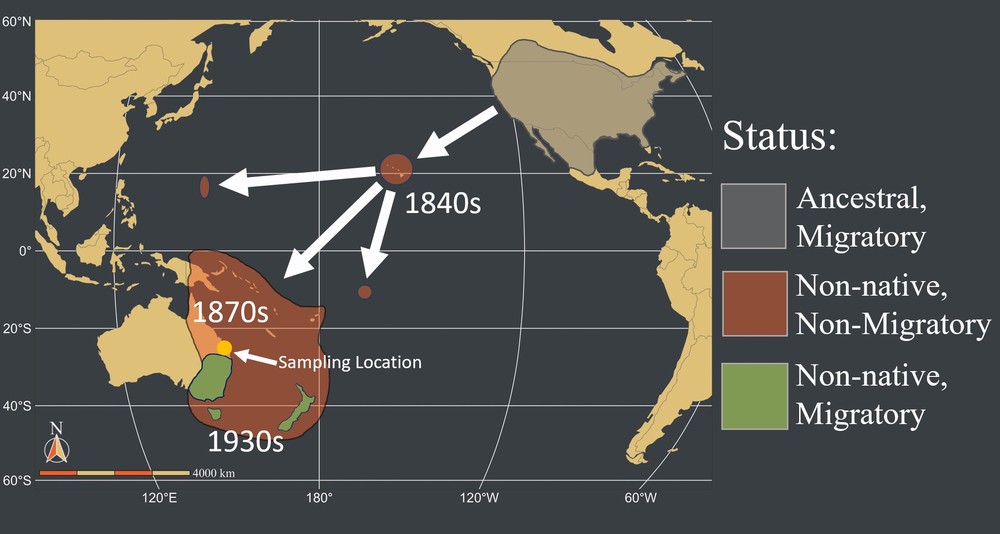
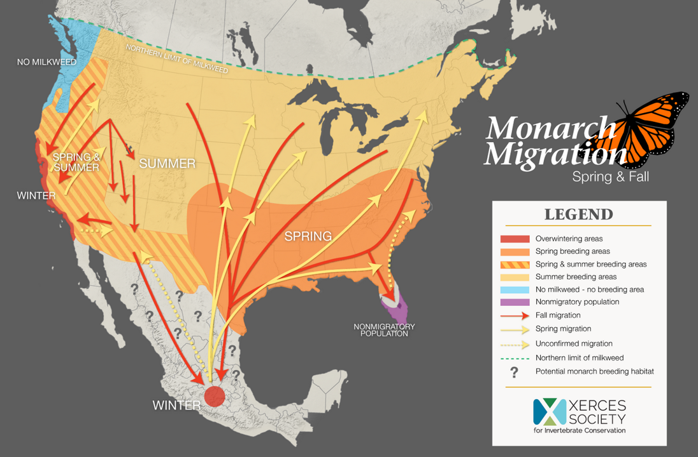

```{r setup, include=FALSE}
library(snpR); library(ggplot2); library(plotly); library(pcadapt)

```

```{css, echo=FALSE}
.spoiler {
  visibility: hidden;
}

.spoiler::before {
  visibility: visible;
  content: "Spoiler alert! Hover me to see the answer."
}

.spoiler:hover {
  visibility: visible;
}

.spoiler:hover::before {
  display: none;
}
```

# The "F-word": The Arcane Art of Genomic Data Filtering 

Today, we're going to explore genomic data filtering and how our filtering decisions can impact our downstream biological findings. We're going to use some Monarch Butterfly data to do so.


# Background: Monarch Butterflies in the Pacific

{width="454"}

Monarch Butterflies (*Danaus plexippus*) are a charismatic, migratory insect species originally from North America. Over the last \~200 years, they have established on a series of islands across the Pacific Ocean, including Hawaii, the Mariana Islands, and Australia. They are non migratory almost everywhere in the western Pacific, although they secondarily re-aquired migratory behavior in southern Australia and New Zealand in the 1930s.

{width="454"}

In North America, the migratory population can be roughly divided into two "populations" -- one in western North America that spends the winter in California and their summer in the western United States and one in eastern North America that winters in central Mexico and summer in the eastern United States.

{width="454"}

Note that they are also native, non-migrants in the Caribbean, Central, and South America, including Colombia where the first photo shown here was taken.

## The Data

This specific data contains genotypes for 251 samples at 50,000 SNP loci. This is a subset of the 500,000+ RADseq loci used for [this paper](https://doi.org/10.1111/mec.16592). Those samples come from:

* North America (91):
    - Mexico (51)
    - California (40)
* Hawaii (12)
* the Mariana Islands (48):
    - Guam (24)
    - Rota (20)
    - Saipan (4)
* Australia (50):
    - Queensland (44)
    - New South Wales (6)

The `.vcf` file containing genotypic information is available at `~/instructor_materials/Will_Hemstrom/2023/Data/monarchs.vcf`. The metadata for these samples is stored in a file named `monarch_metadata.tsv` in the `~/instructor_materials/Will_Hemstrom/2023/Data` folder.

# Questions and Objectives

Today, we are going to use this data to try determine if our filtering approaches change the results we get for any of the following:

1. Is there population structure in monarchs butterflies in the Pacific? Does the population structure of monarch butterflies suggest anything about their establishment history?
2. How do heterozygosity and the number of polymorphic loci vary across the Pacific? Do any populations show evidence of inbreeding or population bottlenecks/expansions?

Lastly, we're also also going to use some simulated data to determine:

3. Does filtering can impact our ability to detect patterns of selection?

# Reading and preparing the monarch data

## Reading

The primary package we are going to use is called `snpR`. It's a SNP genomic analysis package that is designed to do a range of basic genomic analyses, such as calculate observed and expected heterozygosity, linkage disequilibrium, pairwise-$F_{ST}$, and so on. It is written around ease-of-use, particularly when analyses need to be split and run for multiple populations, families, sampling years, etc. It also has filtering and visualization tools, which we will be using here.

```{r, eval=FALSE}
library(snpR)
```


`snpR` can read a range of imput formats, including our `.vcf` file. We can attaching our sample metadata simultaneously:
```{r, eval=FALSE}
monarchs <- read_vcf("~/instructor_materials/Will_Hemstrom/2023/Data/monarchs.vcf", 
                     sample.meta = "~/instructor_materials/Will_Hemstrom/2023/Data/monarch_metadata.tsv")
```

We can request a report on our data by calling the `monarch` object directly.
```{r, eval=FALSE}
monarchs
```

This tells us a few things: the number of samples and loci, their average and minimum minor allele frequency (the frequency of the less common allele at each locus), the proportion of missing data, and some info no the metadata we have available to us.

**Note: metadata categories in `snpR` are referred to as `facets`, and we will use that language here as well.** For example, `pop` is the facet with population info in our data, and has the levels described above.

## Filtering

_Basically all genomic data is imperfect_: genotyping errors, missing data, linked loci, and so on are essentially ubiquitous. These can all cloud our data and make it much harder to evaluate. To help remove some of these, we're going to apply some *filters* to our data. However, because we are inevitably also going to accidentally remove some good data, we should *always compare our data with different filters*. `snpR` has a function to make this easy: `filter_snps()`. 

### Filtering Options

There are an staggering number of metrics by which to filter genetic data, but a few of the most common approaches post-genotypes are:

* MAF (Minor Allele Frequency) filtering: Removing SNPs for which the rarer (or "minor") allele is below some specific frequency. Rare alleles can arise because of sequencing or alignment errors and can sometimes obscure population structuring estimation, but may also be biologically important or useful for detecting selection. An alternative to this is Minor Allele Count (MAC) filtering, which removes loci based on the count of the minor allele instead of the frequency.

* HWE filtering: Sequencing errors, paralogy, and a range of other undesirable causes can push loci out of HWE, and HWE is a common assumption of downstream models. However, biologically important processes that we may want to detect can *also* push loci out of HWE. *Remember from our lecture that respecting putative population IDs is critical to HWE calculation! We need to make sure we calculate HWE within populations when filtering*

* Genotyping coverage and missing data: We may want to remove individuals *OR* loci that that are poorly sequenced, since large amounts of missing data can make those individuals/loci uniformative, and individuals/loci with large amounts of missing data may be more likely to have bad genotype calls where they are genotyped. However, throwing away *too* many individuals/loci can reduce statistical power, and abundant missing data is an unfortunate reality of most next-generation sequencing efforts.


### Filtering choices

We can filter our data using `snpR`'s `filter_snps()` function. We can set our filtering choices using these arguments:

* `maf`: set a minimum acceptable MAF.
* `maf_facets`: accept loci that pass the MAF filter in *any* facet category. Important for similar reasons that it is important to respect facets/populations when HWE filtering.
* `mac` or `mgc`: alternatives to MAF filtering, remove loci with either a Minor Allele Count (MAC) or that appear in few individuals (Minor-allele Genotype Count, MGC).
* `hwe`: set a minimum acceptable HWE p-value. Loci more significantly out of HWE will be removed. We can use multiple testing correction (or "Family-Wise Error correction, FWE) using the `fwe_method` argument if we wish.
* `hwe_facets`: accept loci that pass our HWE filter in *all* facet categories.
* `min_ind`: sets a minimum proportion of *individuals* that a *locus* must be sequenced in in order to be retained.
* `min_loci`: sets a minimum proportion of *loci* that an *individual* must be sequenced at in order to be retained.

### Creating filtered data

We're going to look for structure with two different filters: a stringent (strict) and non-stringent (relaxed) filter.

The data you already have will be our non-stringent filter. It was filtered with these settings:

* a minimum HWE p-value of $1 \times 10^{-6}$ with the facet `pop`.
* a minimum MGC of 1.
* keep individuals sequenced only in 50% of loci
* keep loci sequenced only in 50% of individuals

For comparison, we'll try a more stringent filtering regime with:

* a minimum HWE p-value of 0.001 with the facet `pop`.
* a minimum MAF of 0.05 with the facet `pop`.
* keep individuals sequenced only in 75% of loci
* keep loci sequenced only in 75% of individuals

```{r, warning=FALSE,message=FALSE,include=FALSE,echo=TRUE}
monarchs_strict <- filter_snps(monarchs, maf = 0.05, maf_facets = "pop", hwe = 0.001, hwe_facets = "pop", min_ind = .75, min_loci = .75)
```


---
*STOP HERE!*

The instructor will break you into two groups, one working with the new, strictly filtered dataset and the other with the initial, less-strictly filtered dataset.
---


# Objective 1: The effect of filtering on population structure assessment

## PCA
First, we're going to run a Principal Component Analysis. This is a great first step in any genomic analysis after filtering, since it can show you if you are missing population structure or have contaminated samples. `snpR` contains the function `plot_clusters()`, which will let you easily run and plot a PCA with your data. We can use the `facets` argument to automatically color by `pop`, one of the metadata columns `snpR` told us was available earlier.

```{r, eval=FALSE}
pca <- plot_clusters(monarchs,
                     facets = "pop")
```

The object returned is a (nested) list, with the plot stored under `$plot$pca`. We can call that (or the object as a whole) to see our plot.

```{r, eval=FALSE}
pca$plots$pca
```

---

### Objective 1 Questions:

1. Is there population structure present in monarchs across the Pacific?
    * Is there structure in the Mariana Islands (GUA, ROT, SAI)? These islands are about 60km apart.
    * Is there structure in North America (ENA, WNA)? These populations are 1,000km+ apart.
    * Is there structure in Australia (QLD, NSW)?
    * How does Hawaii fit into the overall picture of monarch structure in the Pacific?

2. Based on the PCA structure results, do you have any hypotheses about the establishment pathway in the Pacific?


***Tip: if you are having trouble figuring out which color is which, you can use the `plotly` package to generate an intractable plot that you can mouse over for population names***

```{r,eval=FALSE}
# install and load
library(plotly)

# make an interactive plot
ggplotly(pca$plots$pca)

```

---

# Objective 2: The effect of filtering on population genetic diversity


We can run most of the statistics we want using a very similar syntax to what we used to run the PCA. One thing to note, though, is that *stat* functions in `snpR` are *overwrite safe*, meaning that you run new test to update an existing object, then fetch the results you want down when you are ready.

Let's start by calculating observed heterozygosity ($H_{O}$). Like before, we'll specify that we want to split our calculations by population (`pop`).

```{r}
monarchs <- calc_ho(monarchs, facets = "pop")

```

We can then 'update' this object by adding expected heterozygosity ($H_{E}$):
```{r}
monarchs <- calc_he(monarchs, facets = "pop")
```

We view the results of these calculations using `get.snpR.stats()`, noting the facet and statistics we want.

```{r}
results <- get.snpR.stats(monarchs, facets = "pop", stats = c("he", "ho"))
```

The result has two parts: `$single` and `$weighted.means`, which contain the statistics per-loci and weighted averages over all loci for each population.

```{r}
results$weighted.means
```

We can plot these statistics using `ggplot`.

```{r}
library(ggplot2)
ggplot(results$weighted.means, aes(x = subfacet, y = weighted_mean_ho)) +
  geom_point() +
  theme_bw()
```

---

### Objective 2 Task 1:

Let's add three more statistics to our data: 

1. `calc_seg_sites()`: The number of polymorphic loci per population, corrected for differences in sample size.
2. `calc_pi()`: The average number of pairwise differences ($\pi$) between populations. A commonly used alternative to $H_{E}$.
3. `calc_private()`: The number of alleles unique to each population, corrected for population size.

### Objective 2 Questions part 1:

1. How do $\pi$, $H_{O}$, and $H_{E}$ compare across populations. Do these make sense given the establishment history?
2. How do the number of polymorphic loci compare? Does this show a different pattern than heterozygosity? Why?
3. How do the numbers of private alleles vary between populations? Are there any problems with how we calculated this? Remember that these are alleles unique to our designated populations, and think about the structure results from yesterday.

---

Next, we'll look for evidence of inbreeding and bottlnecks using $F_{IS}$ and *Tajima's D*. 

---

### Objective 2 Task 2:

1. Calculate $F_{IS}$: use `calc_fis()` with the same syntax you used in Part 1, fetch with `get.snpR.stats()`, and plot.
2. Calculate *Tajima's D*: use `calc_tajimas_d()`. Use the argument `global = TRUE` alongside `facets = "pop"` to tell `snpR` we want an overall *Tajima's D* and not sliding window values. Fetch with `get.snpR.stats()` and plot.

### Objective 2 Questions part 1:

1. Do any populations display substantial inbreeding our outbreeding? Which populations are the most in/outbread?
2. Do any populations show evidence of bottlenecks or expansions? Do these make biological sense? Remember that $D > 0$ is a bottleneck signal, $D < 0$ is an expansion signal. 

---


# Objective 3: The effect of filtering on selection detection

In this portion, we'll use simulated data that has known selection events at known loci.

Remember that selection is often broken down into three categories:

1. Directional selection: selection favors phenotypes on one extreme or the other.

2. Stabilizing or Purifying selection: selection favors the mean phenotype.

3. Balancing selection: selection favors whichever phenotype *is less frequent*.

```{r, echo=FALSE, eval=TRUE}
p1dir <- data.frame(Frequency = c(dnorm(seq(-5, 5, .1)), dnorm(seq(-5, 5, .1), 1)),
                    Phenotype = seq(-5, 5, .1),
                    Time = rep(c("Before Selection", "After Selection"), each = 101),
                    Selection_Type = "Directional Selection")
p1stab <- data.frame(Frequency = c(dnorm(seq(-5, 5, .1)), dnorm(seq(-5, 5, .1), sd = .5)),
                    Phenotype = seq(-5, 5, .1),
                    Time = rep(c("Before Selection", "After Selection"), each = 101),
                    Selection_Type = "Stabilizing Selection")
p1balancing <- data.frame(Frequency = c(dnorm(seq(-5, 5, .1)), dnorm(seq(-5, 5, .1), sd = 2)),
                    Phenotype = seq(-5, 5, .1),
                    Time = rep(c("Before Selection", "After Selection"), each = 101),
                    Selection_Type = "Balancing Selection")

p1d <- rbind(p1dir, p1stab, p1balancing)

p1 <- ggplot(p1d, aes(x = Phenotype, y = Frequency, color = Time)) + geom_line(linewidth = 1) + theme_bw() + facet_wrap(~Selection_Type, nrow = 1) + theme(strip.background = element_blank()) + scale_color_viridis_d(option = "inferno", end = .5)
p1
```


From the perspective of alleles at a single locus, these often translate to:

1. Directional selection -> selection favors one allele over the others, specifically when that allele moves the phenotypic distribution in a new direction.

2. Stabilizing/Purifying selection -> selection favors one allele over others, specifically when that allele maintains the current most common phenotype (we won't work with detecting purifying selection in this workshop).

3. Balancing selection -> selection favors whichever allele is less common, often due to a heterozygote advantage. There can be nuance to this, where the equilibrium allele frequency is actually shifted towards one allele if that allele's homozygote is more fit than the other, but still less fit than the heterozygote.

## Detecting selection
There are many approaches for detecting selection using genome-wide data. For example:

* Selective (*hard*) sweeps, where a new mutation is selected to a high frequency or fixation should cause a local reduction in genetic diversity ($H_{O}$/$H_{E}$, calculated in `snpR` with `calc_ho()` and `calc_he()`). (As a side note, selective *soft* sweeps can be very, very difficult to detect and are not covered here. Rita's PCAadapt workshop might help with this, for example!)

* Balancing selection should cause the loci under selection to have an excess of heterozygotes ($H_{O}$ larger than the expected $H_{E}$, causing a negative inbreeding coefficient $F_{IS}$ and the loci to be out of HWE. These are calculated in `snpR` with `calc_ho()`, `calc_he()`, `calc_fis()`, and `calc_hwe()`, respectively).

* Local Tajima's D should be positive when nearby loci are under balancing selection and negative when they are under directional selection (sliding window Tajima's D can be calculated in `snpR` with `calc_tajimas_d()`).

Note that $F_{ST}$ can also be very useful for detecting selection in one population when multiple are available, but we will work only with single population data.

## Group work

The following three exercises all work with data simulated under one of the above selection regimes. The data is completely unfiltered--every segregating site and individual is still present in the data. Split into three groups and work with one dataset each! Use `snpR` to filter the data at two different levels of stringency, then look for any patterns of selection. Note that there is only one population here.

*HINT:* [You may want to consider *no MAF filter* for one filtering regime]{.spoiler}


## Groups {.tabset}

### Group 1

First, read in your data. The pre-made snpRdata object is compressed in R's `.RDS` format, and can be read in with `readRDS()`. There is no sample metadata for this data set.

```{r,eval=FALSE}
# read
group_1_data <- readRDS("~/instructor_materials/Will_Hemstrom/2023/Data/group1.RDS")
group_1_data
```

Try filtering the data with `filter_snps()` at a few different levels of MAF and HWE stringency. There is no missing data or sample facets here, so you can ignore the `hwe_facets`, `maf_facets`, `min_ind` and `min_loci`.

Once you've filtered the data, look for evidence of selection. For example, if we wanted to look for evidence of a local reduction in heterozygosity, which could be indicative of a selective sweep, we could calculate $H_{E}$, calculate the smoothed average with `calc_smoothed_averages()`, then plot the results with `plot_manhattan()`.

```{r,eval=FALSE}
ex <- calc_he(stickSNPs) # with snpR's example data
ex <- 
  calc_smoothed_averages(ex, 
                         facets = "chr",
                         sigma = 100, # this controls the window size, in mb. Windows are 4*sigma wide)
                         step = 50, # this controls the step size between windows, in mb
                         stats.type = "single", # this says that we don't have any pairwise stats, like Fst, to smooth.
                         verbose = TRUE)


# Plot! To figure out the plot_var, try running get.snpR.stats() and check the output for the name. 
# In most cases it is the statistic name, 
# but for Tajima's D it is just "D" (since calc_tajimas_d() also returns a few other things).
pm <- plot_manhattan(ex, 
                     plot_var = "he",  
                     window = TRUE, # To plot the raw values for each SNP instead, we could change this to FALSE
                     chr = "chr") # note the chromosome column

pm$p

```

If you are plotting a *p*-value, you can set `log.p = TRUE`.

Try calculating and plotting a few different statistics, both windowed and not, under a few different filtering strategies.

Questions:
1. Do you see any evidence of selection? If so, what kind and at what loci?
2. Did your filtering strategies change your ability to detect selection?

ANSWER KEY:
[Balancing selection at chr2, positions 318943 and 5618470; chr5, position 7202280; and chr9, position 2134490; ]{.spoiler}

### Group 2

First, read in your data. The pre-made snpRdata object is compressed in R's `.RDS` format, and can be read in with `readRDS()`. There is no sample metadata for this data set.

```{r,eval=FALSE}
# read
group_2_data <- readRDS("~/instructor_materials/Will_Hemstrom/2023/Data/group2.RDS")
group_2_data
```

Try filtering the data with `filter_snps()` at a few different levels of MAF and HWE stringency. There is no missing data or sample facets here, so you can ignore the `hwe_facets`, `maf_facets`, `min_ind` and `min_loci`.

Once you've filtered the data, look for evidence of selection. For example, if we wanted to look for evidence of local, which could be indicative of a selective sweep, we could calculate $H_{E}$, calculate the smoothed average with `calc_smoothed_averages()`, then plot the results with `plot_manhattan()`. We'll use `snpR`'s example data, `stickSNPs` here, but the code will be very similar with your data.

```{r,eval=FALSE}
ex <- calc_he(stickSNPs) # with snpR's example data
ex <- 
  calc_smoothed_averages(ex, 
                         facets = "chr",
                         sigma = 100, # this controls the window size, in mb. Windows are 4*sigma wide)
                         step = 50, # this controls the step size between windows, in mb
                         stats.type = "single", # this says that we don't have any pairwise stats, like Fst, to smooth.
                         verbose = TRUE)


# Plot! To figure out the plot_var, try running get.snpR.stats() and check the output for the name. 
# In most cases it is the statistic name, 
# but for Tajima's D it is just "D" (since calc_tajimas_d() also returns a few other things).
pm <- plot_manhattan(ex, 
                     plot_var = "he",  
                     window = TRUE, # To plot the raw values for each SNP instead, we could change this to FALSE
                     chr = "chr") # note the chromosome column

pm$p

```

If you are plotting a *p*-value, you can set `log.p = TRUE`.

Try calculating and plotting a few different statistics, both windowed and not, under a few different filtering strategies.

**Hint** 
[You may want to try setting the `non-poly` argument in `filter_snps()` to `FALSE`...]{.spolier}

Questions:
1. Do you see any evidence of selection? If so, what kind and at what loci?
2. Did your filtering strategies change your ability to detect selection?


ANSWER KEY:
[Completed hardsweep (to fixation of selected allele) at chr8, position 700000]{.spoiler}

### Group 3

First, read in your data. The pre-made snpRdata object is compressed in R's `.RDS` format, and can be read in with `readRDS()`. There is no sample metadata for this data set.

```{r,eval=FALSE}
# read
group_3_data <- readRDS("~/instructor_materials/Will_Hemstrom/2023/Data/group3.RDS")
group_3_data
```

Try filtering the data with `filter_snps()` at a few different levels of MAF and HWE stringency. There is no missing data or sample facets here, so you can ignore the `hwe_facets`, `maf_facets`, `min_ind` and `min_loci`.

Once you've filtered the data, look for evidence of selection. For example, if we wanted to look for evidence of local, which could be indicative of a selective sweep, we could calculate $H_{E}$, calculate the smoothed average with `calc_smoothed_averages()`, then plot the results with `plot_manhattan()`. We'll use `snpR`'s example data, `stickSNPs` here, but the code will be very similar with your data.

```{r,eval=FALSE}
ex <- calc_he(stickSNPs) # with snpR's example data
ex <- 
  calc_smoothed_averages(ex, 
                         facets = "chr",
                         sigma = 100, # this controls the window size, in mb. Windows are 4*sigma wide)
                         step = 50, # this controls the step size between windows, in mb
                         stats.type = "single", # this says that we don't have any pairwise stats, like Fst, to smooth.
                         verbose = TRUE)


# Plot! To figure out the plot_var, try running get.snpR.stats() and check the output for the name. 
# In most cases it is the statistic name, 
# but for Tajima's D it is just "D" (since calc_tajimas_d() also returns a few other things).
pm <- plot_manhattan(ex, 
                     plot_var = "he",  
                     window = TRUE, # To plot the raw values for each SNP instead, we could change this to FALSE
                     chr = "chr") # note the chromosome column

pm$p

```

If you are plotting a *p*-value, you can set `log.p = TRUE`.

Try calculating and plotting a few different statistics, both windowed and not, under a few different filtering strategies.

Questions:
1. Do you see any evidence of selection? If so, what kind and at what loci?
2. Did your filtering strategies change your ability to detect selection?

ANSWER KEY:
[Incomplete hardsweep (no fixation of selected allele) at chr8, position 700000]{.spoiler}
