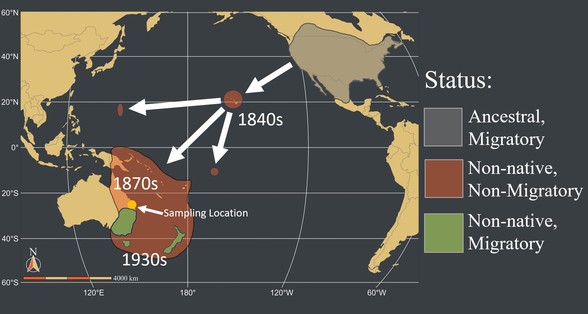
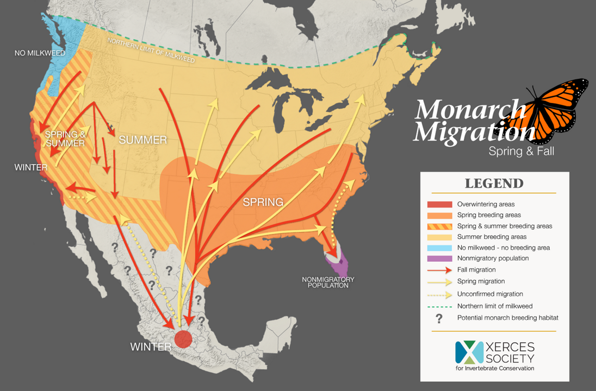

```{r setup, include=FALSE}
knitr::opts_chunk$set(echo = TRUE, eval = FALSE)
library(snpR)
```

In this portion of the workshop, we'll now work on how to explore and visualize population structure using the same tools (DAPC, PCA, STRUCTURE, and a tree) in R using some RADseq SNP data.

First, let's discuss the data and background a bit:

# Monarch Butterflies in the Pacific

{width="454"}

Monarch Butterflies (*Danaus plexippus*) are a charismatic, migratory insect species originally from North America. Over the last \~200 years, they have travelled to a series of islands across the Pacific Ocean. They reached Hawaii in the 1840s, Australia in the 1870s, and in roughly 1900, they reached the Mariana Islands, including Guam and Rota islands. They are non migratory almost everywhere in the western Pacific, although they secondarily re-aquired migratory behavior in southern Australia and New Zealand in the 1930s.

{width="454"}

In North America, the migratory population can be roughly divided into two "populations" -- one in western North America that spends the winter in California and their summer in the western United States and one in eastern North America that winters in central Mexico and summer in the eastern United States.

{width="454"}

Note that they are also native, non-migrants in the Carribean, Central, and South America, including Colombia where the first photo shown here was taken.

## The Data

Located in the `Data` folder, there is a file called `monarchs.vcf`. This is a compressed file in the Variant Call Format (*.vcf*). The file format was originally described [here](https://doi-org.ezproxy.lib.purdue.edu/10.1093/bioinformatics/btr330) in 2011 and is now the dominant format used to store next-generation sequencing data, from RAD-seq to whole-genome sequencing. The instructor will show and describe the format for you.

This specific data contains genotypes for 251 samples at 50,000 SNP loci. This is a subset of the 500,000+ RADseq loci used for [this paper](https://doi.org/10.1111/mec.16592). Those samples come from:

* North America (91):
    - Mexico (51)
    - California (40)
* Hawaii (12)
* the Mariana Islands (48):
    - Guam (24)
    - Rota (20)
    - Saipan (4)
* Australia (50):
    - Queensland (44)
    - New South Wales (6)

The metadata for these samples is stored in a file named `monarch_metadata.tsv` in the `Data` folder.

## Questions

Today, we are going to use this data to try and answer the following questions:

1. Is there population structure in monarchs butterflies in the Pacific?
2. Does the population structure of monarch butterflies suggest anything about their establishment history?
3. Guam and Rota are approximately 60km apart. Is there population structure between these two islands?
4. The wintering grounds for the monarchs from eastern and western North America are 2000km+ apart. Is there population structure between these two populations?
5. Do any of our answers change depending on how we filter our data? Are some of our structure methods more or less sensitive to filtering?

# Reading and preparing the monarch data

## Reading

We're going to use a couple of R packages to answer these questions. If you are new to R, don't be concerned--between the tutorial we had this morning and the instructors, you'll get through it!

The primary package we are going to use is called `snpR`. It's a SNP genomic analysis package that is designed to do a range of basic genomic analyses, such as calculate observed and expected heterozygosity, linkage disequilibrium, pairwise-$F_{ST}$, and so on. It is written around ease-of-use, particularly when analyses need to be split and run for multiple populations, families, sampling years, etc. It also has filtering and visualization tools, which we will be using here.

The other package we are going to use is `adegenet`, the same package you used with the Wolf microsatellite data earlier.

First, we need to install the `snpR`.

```{r, eval=FALSE}
install.packages(remotes)
remotes::install_github("hemstrow/snpR")
```

Next, we need to load in the package:

```{r, eval=FALSE}
library(snpR)
```


Next, we are going to read in our `.vcf` file, attaching our sample metadata:
```{r, eval=FALSE}
monarchs <- read_vcf("Data/monarchs.vcf", sample.meta = "Data/monarch_metadata.tsv")
```

We can request a report on our data by calling the `monarch` object directly.
```{r, eval=FALSE}
monarchs
```

This tells us a few things: the number of samples and loci, their average and minimum minor allele frequency (the frequency of the less common allele at each locus), the proportion of missing data, and some info no the metadata we have available to us.

**Note: metadata categories in `snpR` are referred to as `facets`, and we will use that language here as well.** For example, `pop` is the facet with population info in our data, and has the levels described above.

## Filtering

_Basically all genomic data is imperfect_: genotyping errors, missing data, linked loci, and so on are essentially ubiquitous. These can all cloud our data and make it much harder to evaluate. To help remove some of these, we're going to apply some *filters* to our data. However, because we are inevitably also going to accidentally remove some good data, we should *always compare our data with different filters*. `snpR` has a function to make this easy: `filter_snps()`. 

### Filtering Options

There are an staggering number of metrics by which to filter genetic data, but a few of the most common approaches post-genotypes are:

* MAF (Minor Allele Frequency) filtering: Removing SNPs for which the rarer (or "minor") allele is below some specific frequency. Rare alleles can arise because of sequencing or alignment errors and can sometimes obscure population structuring estimation, but may also be biologically important or useful for detecting selection.

* HWE filtering: Sequencing errors, paralogy, and a range of other undesirable causes can push loci out of HWE, and HWE is a common assumption of downstream models. However, biologically important processes that we may want to detect can *also* push loci out of HWE.

* Genotyping coverage and missing data: We may want to remove individuals *OR* loci that that are poorly sequenced, since large amounts of missing data can make those individuals/loci uniformative, and individuals/loci with large amounts of missing data may be more likely to have bad genotype calls where they are genotyped. However, throwing away *too* many individuals/loci can reduce statistical power, and abundant missing data is an unfortunate reality of most next-generation sequencing efforts.

### Filtering choices

We can filter our data using `snpR`'s `filter_snps()` function. We can set our filtering choices using these arguments:

* `maf`: set a minimum acceptable MAF.
* `maf_facets`: accept loci that pass the MAF filter in *any* facet category.
* `mac` or `mgc`: alternatives to MAF filtering, remove loci with either a Minor Allele Count (MAC) or that appear in few individuals (Minor-allele Genotype Count, MGC).
* `hwe`: set a minimum acceptable HWE p-value. Loci more significantly out of HWE will be removed. We can use multiple testing correction (or "Family-Wise Error correction, FWE) using the `fwe_method` argument. `holm`, for the sequential Bonferroni approach, is a good, standard, and fairly conservative method of FWE correction.
* `hwe_facets`: accept loci that pass our HWE filter in *all* facet categories.
* `min_ind`: sets a minimum proportion of *individuals* that a *locus* must be sequenced in in order to be retained.
* `min_loci`: sets a minimum proportion of *loci* that an *individual* must be sequenced at in order to be retained.

### Creating filtered data

We're going to look for structure with two different filters: a stringent (strict) and non-stringent (relaxed) filter.

The data you have will be our non-stringent filter. It was filtered with these settings:

* a minimum HWE p-value of $1 \times 10^{-6}$ with the facet `pop`.
* a minimum MGC of 1.
* keep individuals sequenced only in 50% of loci
* keep loci sequenced only in 50% of individuals

For comparison, we'll try a more stringent filtering regime with:

* a minimum HWE p-value of 0.001 with the facet `pop`.
* a minimum MAF of 0.05 with the facet `pop`.
* keep individuals sequenced only in 75% of loci
* keep loci sequenced only in 75% of individuals

```{r, warning=FALSE,message=FALSE,include=FALSE,echo=TRUE}
monarchs_strict <- filter_snps(monarchs, maf = 0.05, maf_facets = "pop", hwe = 0.001, hwe_facets = "pop", min_ind = .75, min_loci = .75)
```


# Evaluating and plotting population structure

## PCA

***You may wish to stop here and wait for the instructor***

First, we're going to run a Principal Component Analysis. This is a great first step in any genomic analysis after filtering, since it can show you if you are missing population structure or have contaminated samples. `snpR` contains the function `plot_clusters()`, which will let you easily run and plot a PCA with your data. We can use the `facets` argument to automatically color by `pop`, one of the metadata columns `snpR` told us was available earlier.

```{r, eval=FALSE}
pca <- plot_clusters(monarchs,
                     facets = "pop")
```

The object returned is a (nested) list, with the plot stored under `$plot$pca`. We can call that (or the object as a whole) to see our plot.

```{r, eval=FALSE}
pca$plots$pca
```

---

### Questions:

1. Is there population structure present in monarchs across the Pacific?
    * Is there structure in the Mariana Islands (GUA, ROT, SAI)?
    * Is there structure in North America (ENA, WNA)?
    * Is there structure in Australia (QLD, NSW)?
    * How does Hawaii fit into the overall picture of monarch structure in the Pacific?
    
2. Based on the PCA structure results, do you have any hypotheses about the establishment pathway in the Pacific?

3. Run the PCA again, but use the strictly filtered dataset `monarchs_strict` instead. Do any of your answers to the questions above change? If so, why do you think they did?


***Tip: if you are having trouble figuring out which color is which, you can install and use the `plotly` package to generate an intractable plot that you can mouse over for population names***

```{r,eval=FALSE}
# install and load
install.packages("plotly")
library(plotly)

# make an interactive plot
ggplotly(pca$plots$pca)

```


---


## DAPC

DAPC is an alternative approach to PCA that sets individuals into a defined number of clusters using the same underlying PCA data. We'll run it using `adegenet`.

```{r, eval=FALSE}
library(adegenet)
```

A DAPC can also be a great way to look for structure in your data if you don't have a good prior for population assignments or the number of populations. This method makes use of the `find.clusters` function within `adegenet` to identify the optimal number of clusters (*k*) through K-means clustering. A measure of goodness-of-fit is provided through Bayesian information criterion (BIC) model selection. 

In the code below, we will first run the `find.clusters` command, which will prompt you to select the optimal number of clusters (*k*). This is usually the inflection point where the BIC value is the lowest. However, note that it is often beneficial to plot the results of multiple *k* values, given that one model may not be significantly better than the others.

Again, we choose the number of PCs to be 85-95% of the total number of individuals.

```{r, eval=FALSE}

monarchs_adeg <- format_snps(monarchs, "adegenet", facet = "pop") # format for adegenet

cluster <- find.clusters(monarchs_adeg, max.n.clust = 20, n.pc = 170, stat = "BIC")

#Assign individuals to the groups determined in the command above
monarch_adeg$pop <- cluster$grp

#Run the DAPC on the assignments from "find.clusters"
monarch_adeg.dapc <- dapc(monarch_adeg, n.pca = 170, n.da = 2)

#Plot the results in PCA-space
scatter(monarch_adeg.dapc, scree.da = TRUE, scree.pca = TRUE, posi.pca = "bottomright", posi.da = "bottomleft", clab = 0)

#Produce a plot of individual membership to each of the clusters
compoplot(monarch_adeg.dapc, lab = "", txt.leg = seq(levels(monarch_adeg.dapc$assign)))

```

Let's again find the optimal number of PCs to use in DAPC analysis, then re-do the DAPC analysis with that number of PCs.

```{r, eval=FALSE}
opt.pca <- optim.a.score(monarch_adeg.dapc)

monarch_adeg.dapc2 <- dapc(monarch_adeg, n.pca = opt.pca$best, n.da=2)
scatter(monarch_adeg.dapc2, scree.da = TRUE, scree.pca = TRUE, posi.pca = "topleft", posi.da = "bottomleft", clab = 0)

compoplot(monarch_adeg.dapc2, lab = "", txt.leg = seq(levels(monarch_adeg.dapc$assign)))

```

In this case, 57 principal components are deemed optimal to use.

---

### Questions:

1. How did results of population structure change when the number of PCs included in the analysis changed?
2. Does using the filtered data produce similar results?
3. How do the results differ from the PCA results?

---

## STRUCTURE

Neither PCA or DAPC are explicitly `genetics` methods--they both are designed to explore any kind of high-dimension quantitative data (although the specific versions we used here are optimized a bit for genetics). STRUCTURE, on the other hand, is designed from the ground up to use genetic data. Your instructor will stop here and talk about STRUCTURE and how it works.

***You may wish to stop here and wait for the instructor***

We can run STRUCTURE with `snpR` as well, using the function `plot_structure()`. This function is a bit more complicated--here's the more involved, *new* arguments that we will use:

* `k`: the number of "populations" that we will assume exist that we will try to group individuals into. Usually, you should try a range of k values and see how our results vary.
* `iterations`: the number of random MCMC runs to do -- higher is better but slower.
* `burnin`: the number of MCMC runs to do before results are tracked. Allows the algorithm to settle into a reasonable search area before it actually starts generating estimates. Higher is better to a point, but slower.
* `structure_path`: The path on your computer to the non-graphical interface version of STRUCTURE. This will vary, but is probably something like `~/Downloads/structure_windows_console/console/structure.exe` if you are on Windows. Ask you instructor for help if needed!
* `facet.order`: This will re-order the results for us to make them easier to interpret. 

Structure is also *really dang slow* with large datasets, and doesn't really need that many loci to do a great job. In this case, we'll try running it with 3,000 loci by subsetting our data first using the usual `[` operator.

```{r, eval=FALSE}
# pick loci to keep randomly
set.seed(23521)
sub <- sample(nsnps(monarchs), 3000, replace = FALSE)
sub <- sort(sub)

# subset
sub_monarchs <- monarchs[sub,]

```
We can then run `plot_structure()`. This might take a few minutes! 

```{r, eval=FALSE}
struct <- plot_structure(sub_monarchs, 
                         facet = "pop",
                         method = "structure",
                         k = 4, 
                         iterations = 1000, 
                         burnin = 100,
                         facet.order = c("ENA", "WNA", "HAW", 
                                         "GUA", "SAI", "ROT",
                                         "NSW", "QLD"),
                         structure_path = "/usr/bin/structure.exe")
```

If it seems like it is taking too long, you can hit the red STOP button in the upper right hand side of your console to stop the run. The instructor has prepared pre-run results for you if needed. They are located at `Data/monarch_non_strict_structure.RDS`, and can be read in to R like this:

```{r, eval=FALSE}
struct <- readRDS("Data/monarch_non_strict_structure.RDS")
```


The result is a nested list with the plot stored under `struct$plot`.

```{r, eval=FALSE}
struct$plot
```


Some notes:

* 1000 iters and 100 burnin is really small--for publication you usually want at least 100,000 iters and 20,000 burnin.
* Usually, you will want to run multiple $k$ values. There are [methods](https://doi.org/10.1111/j.1365-294X.2005.02553.x) to evaluate which $k$ best fits your data, although they aren't perfect.
* Since STRUCTURE is a random process, you usually want to run it multiple times at each $k$. The program CLUMPP can condense results from multiple runs--the `clumpp_path` argument can let you do this automatically with `plot_clusters()`.

---

### Questions:

1. Answer the same questions you answered for PCA and DAPC based on the STRUCTURE results--are your answers different with STRUCTURE? If so, why do you think that might be?

2. Re-run STRUCTURE with the `monarch_strict` data. You will need to generate a new `sub` object using the code above. A pre-run output is available at `Data/monarch_strict_structure.RDS`. Are your results different? If so, why do you think they might be?

---


## Neighbor-joining Trees

***You may wish to stop here and wait for the instructor***

Lastly, we'll make and plot a basic neighbor joining tree. We can use the `calc_tree()` function in `snpR` to do this, but we need to install a dependancy, `ape`, first. You don't need to `library()` it!

```{r, eval=FALSE}
install.packages(ape)
```

We can then run the tree:

```{r, eval=FALSE}
tree <- calc_tree(monarchs_strict)
```

The labels of this tree will be a bit messy unless we fix them, which we can do that by using the sample metadata in the `monarchs` object. The labels are stored at `tree$tree$.base$tip.label`.

```{r, eval=FALSE}
# fetch the metadata
meta <- sample.meta(monarchs)

# fix the labels.
tree$.base$.base$tip.label <- meta$pop

```

We can then use the `plot()` function to plot the tree. We need to define colors based on the tip labels, which is a bit of a pain but doable.

```{r, eval=FALSE}
# define our colors, from the khroma package's batlow scale
colors <- c("#001959", "#113F5F", "#2C635B", "#617940", 
            "#A28A2D", "#E9995E", "#FDB1AB", "#F9CCF9")

# match colors to our data using factor magic -- talk to the instructor for info
tip_colors <- colors[as.numeric(as.factor(tree$.base$.base$tip.label))]

plot(tree$.base$.base, type = "unrooted", tip.color = tip_colors)
```

---

### Questions:

1. Answer the same questions you answered for PCA/DAPC/STRUCTURE results--are your answers different with STRUCTURE? If so, why do you think that might be?


2. Re-run the tree with the `monarch_strict` data. Are your results different?

---


# Final Questions

1. Now that we've run everything, which methods produced the most similar results? Any ideas about why that might be?

2. What were the overall differences between our stringently and non-stringently filtered datasets?
    * Which methods do you think were the least influenced by filtering strength?
    * Which specific filters (MAF, missing data, etc) do you suspect might have had the strongest effects? If you have time, you could make new filtered datasets and test your hypotheses.
    
3. Taken together, how would you describe the population structure of the data. What does this suggest about establishment history?

4. Compare the amount of genetic distance between the samples from the Mariana Islands and North America. Which had more structure? Do you have any hypotheses that could explain your findings?